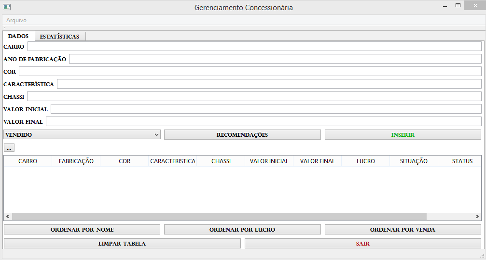
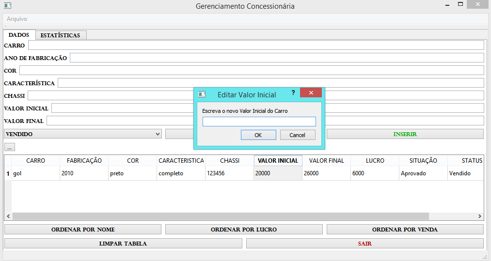
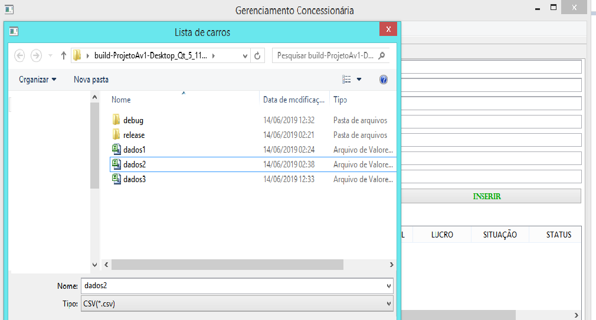
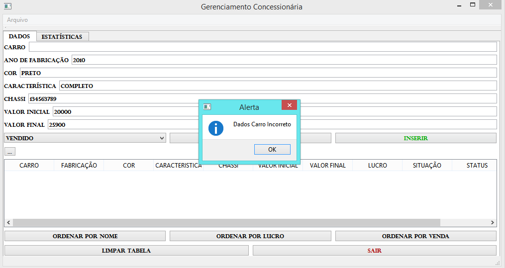
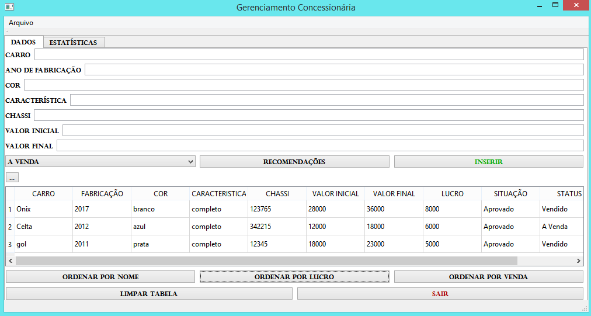
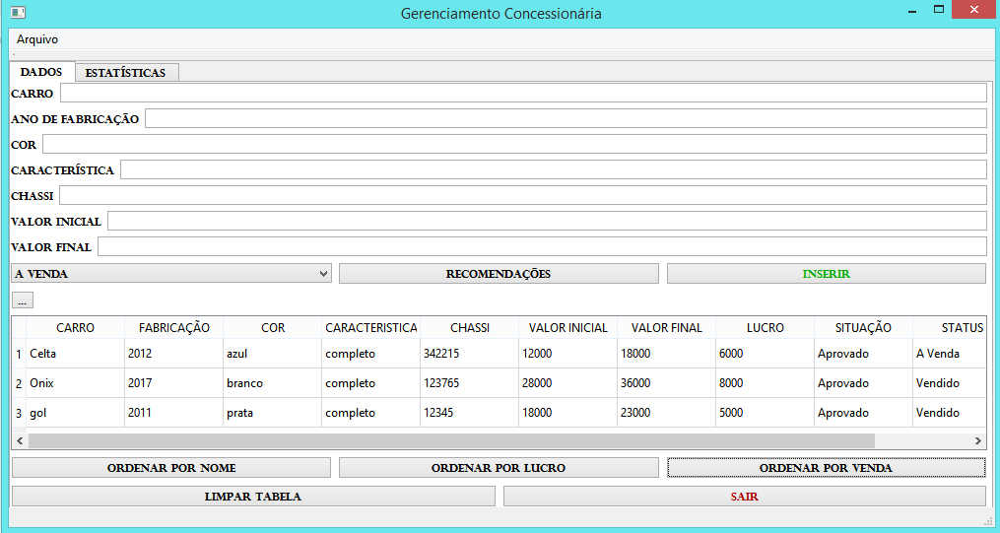
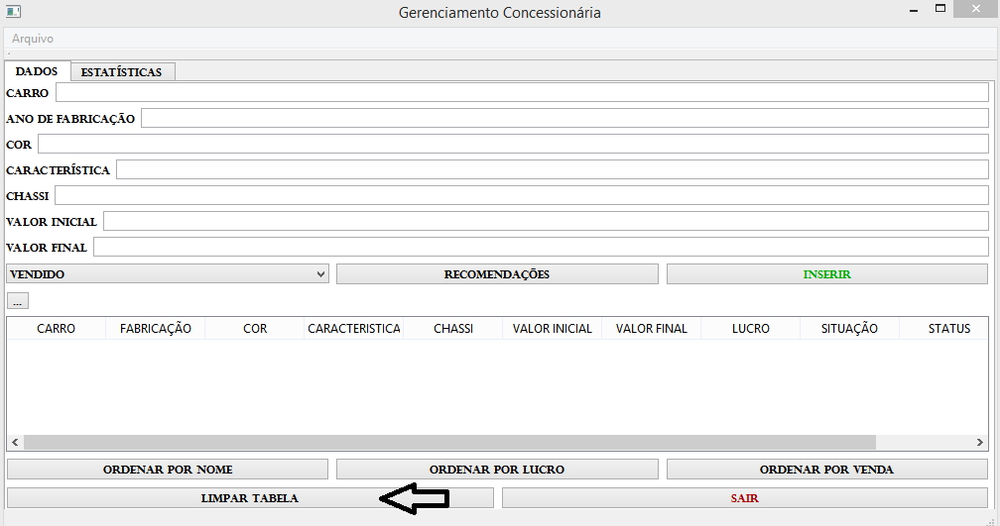

# Gerenciamento Concessionária
Projeto Programação Estruturada
### Manual de realização para uso do projeto, Gerenciamento para Concessionárias.

O projeto deve trazer melhorias para a utilização de cadastros para automóveis, sendo elas, as especificações necessárias para o poder de compra. 
Como nos mostra a Figura Abaixo.
### Cadastro do Automóvel

O projeto acompanha especificações, como uma aba para estatísticas de "Valores Investidos, Lucro Previsto, Lucro Real" .
Como nos mostra na Figura Abaixo.
### Estatísticas da Concessionária

Algumas propriedades que o programa traz para utlização, são os cadastros de diversos automóveis. Podendo ser inseridas na tabela do Manual, para que o proprietário do programa possa observar os dados cadastrados, como também, o lucro que cada automóvel está gerando para concessionária, sua situação se está aprovada ou não para Venda e se o carro já foi Vendido ou se está no patio À Venda. Caso o proprietário deseja fazer mudanças nos dados cadastrados, o programa traz essa opção de alterar valores, apenas clicando 2x no valor desejado. 
Como nos mostra na Figura Abaixo.
### Tela para alteração de Cadastro

Como informado no momento anterior, o programa traz dados como se o carro está "Vendido ou À Venda", mas como para melhoria de todo o projeto, foi colocado as especicações para o proprietário escolher na hora do cadastro do automóvel se ele está sendo Vendido ou se ele está À Venda. 
Como nos mostra na Figura Abaixo.
### Tela para alteração de Venda

Uma das especificações do projeto é o uso de Arquivos, com a opção de salvar arquivos na sua maquina, e carregar arquivos que já foram salvos do programa. Isso traz uma boa prática de salvar arquivos do dia, ou da maneira que o usuário preferir. Os dados podem salvos ou carregados a partir de uma aba.
como nos mostra na Figura Abaixo.
### Tela para uso de Arquivos

Os arquivos estarão Salvos na pasta build do programa, podendo nomear cada Arquivo conforme o usuário desejar. 
Como nos mostra na Figura Abaixo.
### Tela dos Dados Salvos

Com base na maneira de não adicionar valores vazios, nome de automóvel e valores incorretos. O programa incentiva o usuário a corrigir todos os erros antes de cadastrar cada automóvel.
### Tela de Alerta 

O programa traz botões para a melhoria de uso e de ordens dos dados, um deles é o botão de ordenar por Nome(Alfabeto). Que ordena todos os nomes dos automóveis.
Como nos mostra na Figura Abaixo.
### Tela Ordenar Nome

Mais um botão para ordenar, é o ordenar por lucro. Que ordena pelo maior lucro até o menor lucro. 
Como nos mostra na Figura Abaixo.
### Tela Ordenar Lucro

O último botão para ordernar, é o ordenar por venda. Que ordena como primeiros lugares os carros que estão À Venda.
### Tela Ordenar Venda

E como mais uma característica, o programa traz como mais um método o botão de limpar. Limpa valores da tabela, como também, valores das estatísticas.
### Tela limpar

Para encerrar o programa, foi criado o botão "SAIR" com a forma correta de encerrar o funcionamento.
### Tela Sair

### Para adquirir o Programa

Basta fazer o download do repositório, no github. E com a instalação do QT Creator na sua máquina, você poderá fazer a utilização do programa segundo as indicações do manual. 

#### Boa utilização no Gerenciamento para Concessionárias.

At.te, Gemison Alves- 20151610503.

