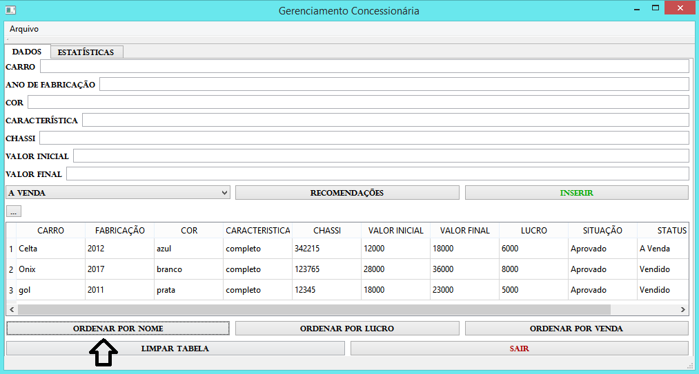

# Gerenciamento Concessionária
Projeto Programação Estruturada
### Manual de realização para uso do projeto: Gerenciamento para Concessionárias.

O projeto deve trazer melhorias para a utilização de cadastros para automóveis, sendo elas, as especificações necessárias para o poder de compra. Tornando mais acessível o cadastro de carros que necessitam calcular o seu lucro de forma mais precisa, e salvar seus cadastros e dados de maneira mais segura.
Como pode ser visualizado na Figura 1.
### Figura 1. Cadastro do Automóvel

O projeto acompanha especificações, como uma aba para estatísticas de *Valores Investidos, Lucro Previsto e Lucro Real*.
Como mostra na Figura 2.
### Figura 2. Estatísticas da Concessionária

O programa traz para sua utilização o cadastro para diversos automóveis, eles podem ser inseridos na tabela do *manual* para que o usuário do programa possa observar os dados cadastrados, como também, o lucro que cada automóvel está gerando para concessionária, além da sua situação se está aprovada ou não para venda e se o carro já foi *vendido* ou se está no patio *à venda*. Caso o proprietário deseja fazer mudanças nos dados cadastrados, o programa oferece a função de alterar os valores, apenas clicando 2 vezes no valor desejado. 

Na Figura 3 é ilustrado o presente cenário
### Figura 3. Tela para alteração de Cadastro

Como visto no momento anterior, o programa exibe dados para informar se o carro encontra-se *vendido* ou *à venda*, porém como melhoria para todo o projeto, foi inserido uma função para o usuário definir na hora do cadastro do automóvel se ele está sendo **vendido* ou se ele está *à venda*.  
Como pode ser visualizado na Figura 4.
### Figura 4. Tela para alteração de Venda

Uma das especificações do projeto é o uso de *arquivos*, com a opção de salvar arquivos na sua maquina, e carregar arquivos que já foram salvos do programa. Isso traz uma boa prática de salvar arquivos do dia, ou da maneira que o usuário preferir. Os dados podem salvos ou carregados a partir de uma aba. 
como visualizamos na Figura 5.
### Figura 5. Tela para uso de Arquivos

Os arquivos estarão Salvos na pasta build do programa, podendo nomear cada Arquivo conforme o usuário desejar. 
Como mostra na Figura Abaixo Figura 6.
### Figura 6. Tela dos Dados Salvos

Com tratamento para o usuário não adicionar valores vazios ou incorretos para os campos do cadastro, o programa incentiva o usuário corrigir todos os erros antes de finalizar o cadastro de cada automóvel.
Veja na Figura 7
### Figura 7. Tela de Alerta 

O programa exibe botões para a melhoria de uso e ordenação dos dados, uma dessas melhorias é o botão de ordenar alfabeticamente pelo *nome do automóvel*.
Como na Figura Figura 8.
### Figura 8. Tela Ordenar Nome

Um outro botão de ordenação é o de *lucro*, em que ordena pelo maior lucro até o menor lucro. 
### Tela Ordenar Lucro

O último botão, é de ordenação por *venda*, que classifica como primeiros lugares os carros que estão à venda.
### Tela Ordenar Venda

Uma outra função do programa é o botão de limpar, ele é responsável por limpar os valores da tabela, como também, os valores das estatísticas.
### Tela limpar

Para encerrar o programa, foi criado o botão "SAIR" para encerrar o funcionamento.
### Tela Sair

### Para adquirir o Programa

Basta fazer o download do repositório, no github. E com a instalação do QT Creator na sua máquina, você poderá fazer a utilização do programa segundo as indicações do manual. 

#### Boa utilização no Gerenciamento para Concessionárias.

At.te, Gemison Alves- 20151610503.

